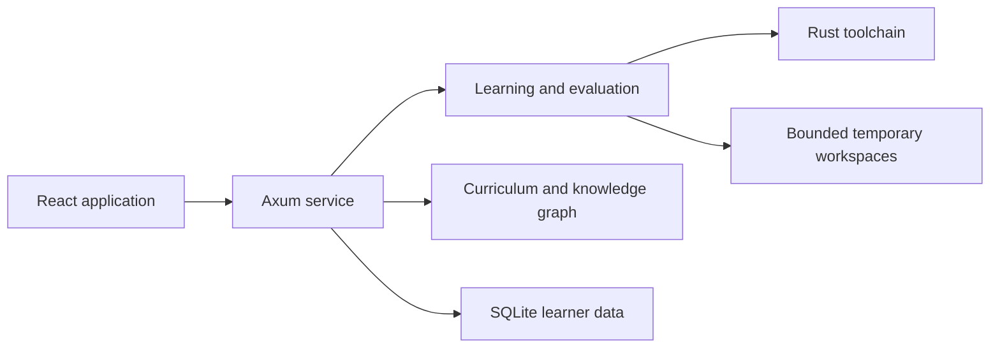

# Rust Tutor

An offline-first Rust learning workbench built around real compiler feedback, deliberate practice,
and inspectable learning evidence.

Rust Tutor combines a structured curriculum, browser-based Rust exercises, adaptive review,
projects, diagnostics, and a searchable knowledge graph in one local application. It uses the real
Rust toolchain, stores learner data on the local machine, and requires no account, cloud service, or
LLM.

## What it includes

- A from-zero Rust course with lessons, checks, runnable examples, and guided practice
- Real `rustc`, Cargo, rustfmt, Clippy, and rust-analyzer feedback
- Monaco editing on workbench routes, with an accessible textarea fallback
- Compiler-backed exercises and hidden-test evaluation
- Evidence-based mastery, spaced review, and explainable recommendations
- Curriculum, concept graph, search, diagnostics, projects, labs, and a final exam
- Randomised chapter, strand, and mixed tests drawn from a compiler-verified question bank, with
  practice, pretest, and confidence-calibration modes
- Research-backed flashcards: successive relearning on expanding intervals, interleaved sessions,
  and automatic cards for every missed test question
- A reference library of 81 free Rust books, courses, exercise sets, tools, and open datasets,
  linked into every chapter and organised into learning paths
- A learning journal and compiler-error catalog
- Local SQLite persistence with backup, export, import, reset, and recovery
- System-aware themes, reduced-motion support, and keyboard-accessible controls

## Status

The React frontend and Axum service are implemented and run locally. The core learning, evaluation,
review, project, graph, search, and data-lifecycle flows are operational.

The full PULSE, QUAY, and TESSERA curriculum catalog is still being authored. Native packaging is
verified locally on Apple Silicon macOS; Linux x86-64 packaging is exercised by CI.

## Architecture



Development uses two loopback processes: Vite serves the frontend and proxies `/api` to the Rust
service. Packaged builds are served by Axum from a single loopback origin.

| Layer | Technology |
| --- | --- |
| Frontend | React 19, TypeScript, Vite |
| Routing and server state | TanStack Router and TanStack Query |
| Editor | Monaco Editor with a textarea fallback |
| Service | Rust, Axum, and Tokio |
| Persistence | SQLite through SQLx |
| Validation | Zod, Biome, Cargo, and repository content validators |
| Package management | pnpm |

## Repository layout

```text
rust_tutor/
├── apps/
│   ├── rust-service/        # Axum API, persistence, evaluation, and Rust tooling
│   └── web/                 # React application
├── content/                 # Reviewed runtime curriculum and generated contracts
├── knowledge/
│   └── feed/generated/
│       └── tutor-feed.json  # Runtime graph embedded by the Rust service
├── schemas/                 # Versioned content schemas
├── scripts/                 # Application content build and validation scripts
├── tools/                   # Development, governance, packaging, and verification tools
├── docs/                    # Architecture, operations, security, and contribution guides
├── PROJECT.md               # Detailed product and engineering reference
└── package.json             # Workspace commands and toolchain requirements
```

Research snapshots, personal notes, local editor state, generated builds, dependencies, and learner data
are intentionally excluded from Git.

## Getting started

### Requirements

- Node.js 24 or newer; Node 26.5.0 is the tested CI runtime
- pnpm 11.9.0
- Rust 1.97.1 with Cargo, rustfmt, Clippy, and rust-analyzer

Install dependencies and start both local processes:

```sh
pnpm install --frozen-lockfile
pnpm dev
```

Open <http://127.0.0.1:3000>. The frontend proxies API requests to the service at
`http://127.0.0.1:4317`.

Run either process separately when needed:

```sh
pnpm dev:web
pnpm dev:service
```

## Commands

| Command | Purpose |
| --- | --- |
| `pnpm dev` | Start the frontend and service |
| `pnpm build` | Build the frontend and Rust workspace |
| `pnpm test` | Run Rust and web tests |
| `pnpm typecheck` | Check TypeScript |
| `pnpm lint` | Run Biome and Clippy |
| `pnpm format:check` | Check Biome and rustfmt formatting |
| `pnpm content:validate` | Validate the committed curriculum and runtime graph references |
| `pnpm governance:validate` | Validate maintained governance records |
| `pnpm ui:verify:static` | Check semantic contrast and UI boundaries |
| `pnpm all-checks` | Run the complete local quality gate |
| `pnpm package:local` | Build a native package for the current supported platform |
| `pnpm package:verify-offline` | Boot and verify the native package without network access |
| `pnpm clean` | Remove generated build and cache output |

## Configuration

No configuration is required for the default local setup. Export these variables before starting the
service when an override is needed; `.env.example` records the same defaults.

| Variable | Default | Purpose |
| --- | --- | --- |
| `RUST_TUTOR_BIND` | `127.0.0.1:4317` | Service bind address |
| `RUST_TUTOR_ALLOWED_ORIGIN` | `http://127.0.0.1:3000` | Permitted development origin |
| `RUST_TUTOR_WEB_DIST` | `apps/web/dist/client` | Built frontend directory |
| `RUST_TUTOR_DATA_DIR` | Platform application-data directory | Optional learner-data directory |
| `RUST_TUTOR_CURRICULUM_V2_PATH` | Committed curriculum release | Optional curriculum override |

Keep the service on a loopback address unless its security boundary has been independently reviewed.

## Local data and security

Learner progress, attempts, review history, projects, notes, and settings are stored in a local
SQLite database.

| Platform | Default database location |
| --- | --- |
| macOS | `~/Library/Application Support/Rust Tutor/rust-tutor.sqlite3` |
| Linux | `$XDG_DATA_HOME/rust-tutor/rust-tutor.sqlite3` |
| Linux fallback | `~/.local/share/rust-tutor/rust-tutor.sqlite3` |

The service binds to loopback, validates hosts and origins, uses per-boot mutation tokens, opens
curriculum content read-only, rejects unsafe Cargo features, scrubs process environments, and bounds
execution time, output, queue size, and workspace size.

These controls reduce accidental local damage; they do not make learner-authored Rust a hostile-code
sandbox. Run only code you understand and trust. See the
[threat model](docs/threat-model.md), [evaluator security notes](docs/evaluator-security.md), and
[data lifecycle guide](docs/data-lifecycle.md).

## Quality

The repository includes Rust unit and integration tests, web contract tests, content and governance
validation, type checking, formatting, linting, production builds, static UI checks, and offline
package verification.

Run the main gate before committing:

```sh
pnpm all-checks
```

CI runs the gate on macOS and Linux, audits production dependencies and licenses, and builds native
packages for both supported targets.

## Current limitations

- The complete curriculum and project catalog is not yet authored.
- Executed Rust is locally contained but is not isolated as hostile code.
- The application targets one local learner rather than shared or multi-tenant use.
- Native packaging has only been locally verified on Apple Silicon macOS; Linux is CI-verified.

## Documentation

- [Getting started](docs/getting-started.md)
- [Architecture](docs/architecture.md)
- [Architecture decisions](docs/adr/README.md)
- [Supported platforms](docs/supported-platforms.md)
- [Content authoring](docs/content-authoring.md)
- [Contributing](CONTRIBUTING.md)
- [Project reference](PROJECT.md)

## License

Rust Tutor application code is licensed under the [MIT License](LICENSE).

Bundled third-party curriculum content has separate terms. In particular, the imported
**100 Exercises to Learn Rust** material is licensed under CC BY-NC 4.0 and is restricted to
noncommercial use. See [THIRD_PARTY_NOTICES.md](THIRD_PARTY_NOTICES.md) and the license metadata in
`content/curriculum-v2/` before redistributing the complete application or its curriculum.
