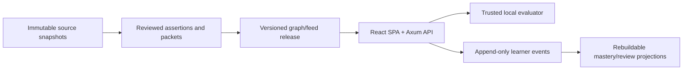

# Architecture and ownership

The browser and one Axum process share an exact loopback origin in production. Handwritten DTOs and Zod decoders form the trust boundary. Curriculum identity is stable and prerequisite edges must remain acyclic; correction appends or supersedes rather than rewriting history. SQLite owns learner events, artifacts, goals, journals, exam attempts, and rebuildable projections. Content files never own learner state.

Mastery uses six explainable states and evidence IDs, not an opaque probability. Completion, time, confidence, and project artifact presence are distinct from durable evidence. Recommendations choose among continue, due review, and prerequisite/project work with inspectable reasons.
